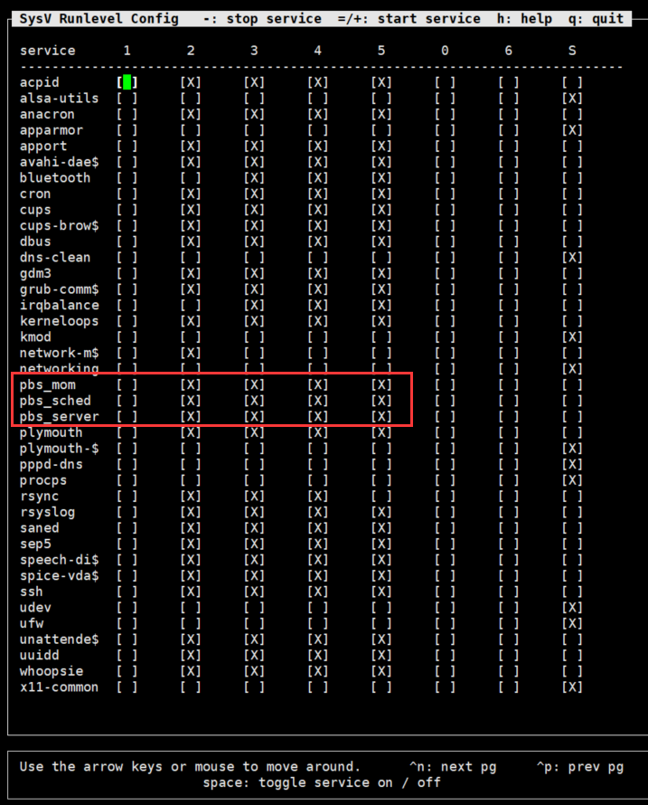

* content
{:toc}

## vasp环境 安装避坑指南 <!--哈哈我是注释，不会在浏览器中显示。-->

<!--正文内容-->

默认 root用户下安装

### 1. 配置远程连接

---

```bash
ufw disable #关闭防火墙
apt install net-tools  # ifconfig可用
apt  install openssh-server #安装ssh-server服务
ps -e | grep ssh #确认ssh-server是否启动了
/etc/init.d/ssh start  # 打开ssh服务
#/etc/init.d/ssh stop  #关闭
```

然后就可以远程连接了

通过xshell或其它工具远程连接方便操作。
hostsname太长了不好操作修改hostsname为localhost

发现vi不好用
`apt install vim`

### 2. scp 拷贝相关软件

```scp -r root@192.168.50.76:/mnt/wind/app/linux/* .```

### 3. 安装Intel编译器

```bash
tar -zxvf parallel_studio_xe_2019_update4_cluster_edition.tgz # 解压
cd parallel_studio_xe_2019_update4_cluster_edition
./install.sh

```

#### 安装过程

1. Welcome

    ```bash
    Welcome
    --------------------------------------------------------------------------------
    Welcome to the Intel(R) Parallel Studio XE 2019 Update 4 Cluster Edition for Linux*
    --------------------------------------------------------------------------------

    You will complete the following steps:
    1.  Welcome
    2.  License Agreement
    3.  Intel® Software Improvement Program
    4.  License Activation
    5.  Options
    6.  Installation
    7.  Complete

    --------------------------------------------------------------------------------
    Press "Enter" key to continue or "q" to quit:

    ```

    `Enter`

2. License Agreement

    ```bash
    License Agreement
    --------------------------------------------------------------------------------
    To continue with the installation of this product you are required to accept
    the terms and conditions of the End User License Agreement (EULA). The EULA
    is displayed using the 'more' utility. Press the spacebar to
    ...................................

    ```

    一路空格

    ```bash
    * Other names and brands may be claimed as the property of others
    --------------------------------------------------------------------------------
    Type "accept" to continue or "decline" to go back to the previous menu:

    ```

    最后一个敲个 `accept`

3. Intel® Software Improvement Program

    ```bash
    --------------------------------------------------------------------------------

    1. I consent to the collection of my Information
    2. I do NOT consent to the collection of my Information

    b. Back
    q. Quit installation

    --------------------------------------------------------------------------------
    Please type a selection:
    ```

    敲个`1`， 然后回车
4. License Activation

    ```bash
    License Activation
    --------------------------------------------------------------------------------
    If you do not have an internet connection, choose to activate with license file
    or Intel(R) Software License Manager.
    --------------------------------------------------------------------------------

    1. Activate with serial number [ default ]
    2. Activate with license file, or with Intel(R) Software License Manager

    h. Help
    b. Back
    q. Quit installation

    --------------------------------------------------------------------------------
    Please type a selection or press "Enter" to accept default choice [ 1 ]:
    ```

    这里是激活部分，我有学生版本的激活码就直接按`1`,然后回车。如果是`license file`的话就可以选`2`,然后会让你输入路径 <!--S4ZD-NRNJGK87-->

    ```bash
    --------------------------------------------------------------------------------
    Please type a selection or press "Enter" to accept default choice [ 1 ]: 1
    Please type your serial number (the format is XXXX-XXXXXXXX): S4ZD-******
    --------------------------------------------------------------------------------
    Checking serial number...
    --------------------------------------------------------------------------------
    Activation completed successfully.
    --------------------------------------------------------------------------------
    Press "Enter" key to continue:
    ```

    `Enter` 然后继续

5. Options

   ```bash
    Options > Configure Cluster Installation
    --------------------------------------------------------------------------------
    Where would you like to install?

    This product can be installed on cluster nodes.
    --------------------------------------------------------------------------------

    1. Finish configuring installation target [ default ]
    2. Installation Target                    [ Current System (Single - Node) ]

    h. Help
    b. Back
    q. Quit installation

    --------------------------------------------------------------------------------
    Please type a selection or press "Enter" to accept default choice [ 1 ]:

    ```

    默认`1`, `Enter`

6. Installation

   ```bash
    Options > Pre-install Summary
    --------------------------------------------------------------------------------
    Install location:  # 注意这里是默认的安装路径
        /opt/intel
    .................
    Installation Target:
    Install on the current system only

    --------------------------------------------------------------------------------

    1. Accept configuration and begin installation [ default ]
    2. Customize installation

    h. Help
    b. Back
    q. Quit installation

    --------------------------------------------------------------------------------
    Please type a selection or press "Enter" to accept default choice [ 1 ]:

   ```

    这里就是显示了各种安装的包，空格之后然后回车。
    然后会显示报错的信息

    ```bash
    Prerequisites > Missing Prerequisite(s)
    --------------------------------------------------------------------------------
    There are one or more unresolved issues based on your system configuration and
    component selection.

    You can resolve all the issues without exiting the installer and re-check, or
    you can exit, resolve the issues, and then run the installation again.

    --------------------------------------------------------------------------------
    Missing optional prerequisites
    -- No compatible Python* found
    -- 32-bit libraries not found
    --------------------------------------------------------------------------------
    1. Skip prerequisites [ default ]
    2. Show the detailed info about issue(s)
    3. Re-check the prerequisites

    h. Help
    b. Back
    q. Quit installation

    --------------------------------------------------------------------------------
    Please type a selection or press "Enter" to accept default choice [ 1 ]:
    ```

    我这里提示的这些不影响vasp使用就直接略过。
    直接`Enter`,然后就开始漫长的安装过程。

    ```bash
    Installation
    --------------------------------------------------------------------------------
    Each component will be installed individually. If you cancel the installation,
    some components might remain on your system. This installation may take several
    minutes, depending on your system and the options you selected.
    --------------------------------------------------------------------------------
    Installing Intel Trace Collector for Intel(R) 64 Architecture component...

    ```

7. Complete

    ```bash
    Complete
    --------------------------------------------------------------------------------
    Thank you for installing Intel(R) Parallel Studio XE 2019 Update 4
    Cluster Edition for Linux*.

    If you have not done so already, please register your product with Intel
    Registration Center to create your support account and take full advantage of
    your product purchase.

    Your support account gives you access to free product updates and upgrades
    as well as Priority Customer support at the Online Service Center
    https://supporttickets.intel.com.


    --------------------------------------------------------------------------------
    Press "Enter" key to quit:
    ```

    完成
配置环境变量

``` bash
vi /etc/profile
    # 添加
    source /opt/intel/bin/ifortvars.sh intel64
    export PATH="/opt/intel/impi/2019.4.243/intel64/bin:$PATH"
    export PATH="/opt/intel/bin:$PATH"
source /etc/profile
```

### 4. vasp编译

首先配置环境变量

```bash
source /etc/profile
vi makefile.include
    # 修改
    MKLROOT    = /opt/intel/mkl
    MKL_PATH   = $(MKLROOT)/lib/intel64

    MPI_INC    = /opt/intel/impi/2019.4.243/intel64/include/
#然后就可以make了
make veryclean
make all
```

静静等...

### 5. ~~pbs安装（失败的安装）~~

终究 pbs安装好之后无法启动。pbsnodes出来都是free了
然而
并没有作用

---
Intel编译器安装的间隙我们先安装pbs作业管理系统

#### 安装 `torque-2.5.11.tar.gz`

```bash
tar torque-2.5.11.tar.gz
cd torque-2.5.11
./config
make
make install

# 直接把contrib/init.d下面的pbs_mom, pbs_sched, pbs_server放到了/etc/init.d下面
# 注意，一定要在pbs_mom中加入一行ulimit -s unlimited然后再放。

vi pbs_mom
#写入
    ulimit -s unlimited
# /root/software/torque-2.5.11/contrib/init.d
cp  pbs_* /etc/init.d/

# 报错 #hostname的问题  
hostname localhost

```bash
root@mgi-Precision-7920-Tower:~/software/torque-2.5.11# ./torque.setup root
initializing TORQUE (admin: root@mgi-Precision-7920-Tower)
Max open servers: 10239
qmgr obj= svr=default: Bad ACL entry in host list MSG=First bad host: mgi-Precision-7920-Tower
Max open servers: 10239
qmgr obj= svr=default: Bad ACL entry in host list MSG=First bad host: mgi-Precision-7920-Tower

```

这里的错误原因应该是hostname的问题
所以建议大家将`hostname`改为 `localhost`

```bash
# 网上找了很多都要修改 `/etc/cloud/cloud.cfg`,我根本没有
ls -l /etc/cloud/cloud.cfg
# 所以不是这样的
hostnamectl set-hostname localhost

vi /etc/hostname
vi /etc/hosts
# 这两个文件也要修改成对应的localhost
reboot # 可有可无

# 继续安装pbs
root@localhost:~/software/torque-2.5.11# qterm
Cannot connect to default server host 'mgi-Precision-7920-Tower' - check pbs_server daemon.
qterm: could not connect to server '' (111) Connection refused
root@localhost:~/software/torque-2.5.11# ./torque.setup root
initializing TORQUE (admin: root@localhost)
PBS_Server localhost: Create mode and server database exists,
do you wish to continue y/(n)?y
Max open servers: 10239
qmgr obj= svr=default: Unauthorized Request
Max open servers: 10239
qmgr obj= svr=default: Unauthorized Request
qmgr obj= svr=default: Unauthorized Request
qmgr obj= svr=default: Unauthorized Request
qmgr obj= svr=default: Unauthorized Request
qmgr obj=batch svr=default: Unauthorized Request
qmgr obj=batch svr=default: Unauthorized Request
qmgr obj=batch svr=default: Unauthorized Request
qmgr obj=batch svr=default: Unauthorized Request
qmgr obj=batch svr=default: Unauthorized Request
qmgr obj=batch svr=default: Unauthorized Request
qmgr obj= svr=default: Unauthorized Request
# 这一堆是默认设置，不管怎样我从来没有用起来过这个默认配置 哈哈哈

# 接下来是重点
vi /var/spool/torque/server_priv/nodes
    # 修改为
    localhost np=24 pool

chmod +644 /var/spool/torque/server_priv/nodes
chmod +755 /var/spool/torque/server_priv

vi /var/spool/torque/server_name
    #修改为
    localhost

# qmgr -c "set server auto_node_np = True"  # 设置默认核数（这个可以不要，就可以自己设置核数）
qmgr -c "create queue pool queue_type=execution"
qmgr -c "set queue pool started=true"
qmgr -c "set queue pool enabled=true"
qterm

for i in pbs_server pbs_sched pbs_mom; do $i ; done
```

运行命令`pbsnodes`,`qstat -q`
如果有如下显示，就说明成功了：

```bash
root@localhost:~/software/torque-2.5.11# pbsnodes
localhost
     state = free
     np = 8
     properties = pool
     ntype = cluster
     status = rectime=1563864232,varattr=,jobs=,state=free,netload=852898,gres=,loadave=0.00,ncpus=24,physmem=32555588kb,availmem=33521044kb,totmem=34652736kb,idletime=708,nusers=6,nsessions=22,sessions=852 858 1451
 1490 1698 1801 1889 1904 2028 2049 2062 2066 2071 2075 2174 2220 2254 2467 2548 2561 2563 2568,uname=Linux localhost 4.18.0-25-generic #26~18.04.1-Ubuntu SMP Thu Jun 27 07:28:31 UTC 2019 x86_64,opsys=linux     gpus = 0

root@localhost:~/software/torque-2.5.11# qstat -q

server: localhost

Queue            Memory CPU Time Walltime Node  Run Que Lm  State
---------------- ------ -------- -------- ----  --- --- --  -----
pool               --      --       --      --    0   0 --   E R
                                               ----- -----
                                                   0     0

```

#### 系统服务管理

```bash
vi /etc/apt/sources.list # 增加软件源
    # 末尾行添加
    deb http://archive.ubuntu.com/ubuntu/ trusty main universe restricted multiverse
apt-get update # 更新软件源
apt-get install sysv-rc-conf
sysv-rc-conf # 勾选如下图所示
```



### 6. cuda 安装

```bash
# 卸载原来的驱动
sudo apt-get remove --purge nvidia*

bash ./cuda_10.1.168_418.67_linux.run
```

```bash
x  End User License Agreement                                                  x
x  -                                                                           x
x                                                                              x
x  NVIDIA Software License Agreement and CUDA Supplement to                    x
x  Software License Agreement.                                                 x
x                                                                              x
x                                                                              x
x  Preface                                                                     x
x  -                                                                           x
x                                                                              x
x  The Software License Agreement in Chapter 1 and the Supplement              x
x  in Chapter 2 contain license terms and conditions that govern               x
x  the use of NVIDIA software. By accepting this agreement, you                x
x  agree to comply with all the terms and conditions applicable                x
x  to the product(s) included herein.                                          x
x                                                                              x
x                                                                              x
x  NVIDIA Driver                                                               x
x                                                                              x
x                                                                              x
xq                                                                             x
x Do you accept the above EULA? (accept/decline/quit):                         x
x                                                                              x
```

`accept`

添加环境变量

```bash
vi /etc/profile
    # for cuda
    export PATH="/usr/local/cuda-10.1/bin:$PATH"
    export LD_LIBRARY_PATH="/usr/local/cuda-10.1/lib64:$LD_LIBRARY_PATH"


```
